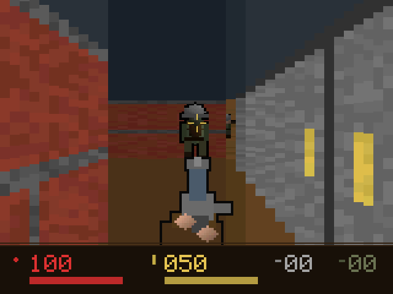
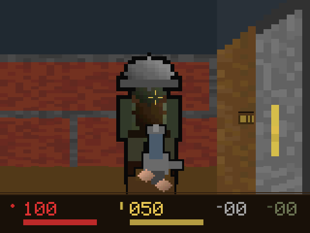
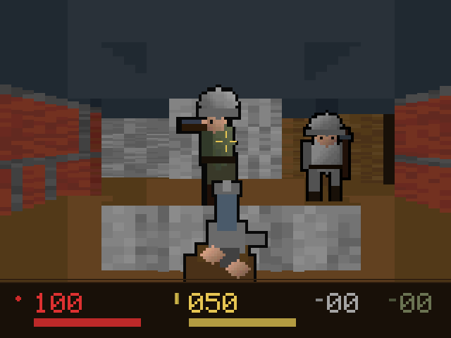
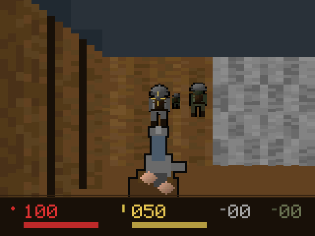
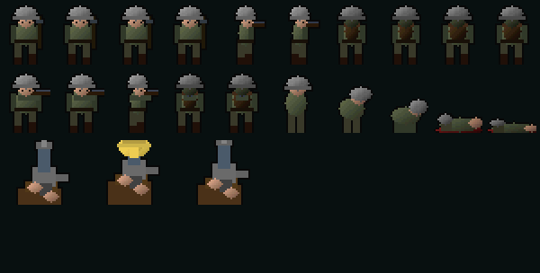

# DOOMCE

A first-person raycaster written from scratch for the **TI-84 Plus CE**.

Textured walls, variable floor and ceiling heights, sliding doors, animated
enemies with a state-machine AI, dodgeable projectiles, pickups and a status
bar — in ~24 KB, on a 48 MHz eZ80.

> **This is an original game, not a port.** It shares a genre and a pun with a
> famous shooter and nothing else. The engine is written from first principles
> and every sprite and texture is generated procedurally at startup by code in
> this repository — there are no assets from any commercial game, and none are
> required to build or play it.

## Screenshots

Everything below is drawn by the engine. Every wall texture, sprite and
animation frame is generated procedurally at startup by code in `src/main.c` —
there are no image assets in this repository.

| | |
|---|---|
|  |  |
| Textured walls, distance shading, an enemy at range | A soldier up close, with the weapon and status bar |
|  |  |
| Variable floor heights — enemies stand at different elevations | Sliding door in a corridor |

The sprite atlas, generated at startup: five rotations with a two-frame walk
cycle, a firing frame per rotation, a five-frame death sequence, and three
weapon frames.



---

## Requirements

### Calculator

| | |
|---|---|
| Model | TI-84 Plus CE (or CE-T / CE Python) |
| **OS version** | **5.3.x or 5.4.x — developed and tested on 5.3.1** |
| Free RAM | ~90 KB |

**OS version matters more than anything else here.**

- **OS 5.3.x / 5.4.x** — native code runs directly. Launch with `Asm(`. This is
  what the game was built and tested against (5.3.1).
- **OS 5.5.1 and newer** — TI removed native-code support. A C program will not
  launch. You need [arTIfiCE](https://yvantt.github.io/arTIfiCE/) (an exploit
  launched through the Cabri Jr app) plus a shell such as Cesium, or you must
  downgrade the OS.
- The **TI-83 Premium CE** is close but not identical and is untested.

### Host

- [CE C/C++ toolchain (CEdev)](https://github.com/CE-Programming/toolchain/releases) — v15.0
- [TI Connect CE](https://education.ti.com/en/products/computer-software/ti-connect-ce-sw) to transfer files
- Optional: [CEmu](https://github.com/CE-Programming/CEmu) to test without hardware

---

## Build

```sh
export PATH="$HOME/CEdev/bin:$PATH"
make
```

Output is `bin/DOOMCE.8xp`.

---

## Install and run

**1. Send the C libraries — once.**

Download `clibs.8xg` from the [CE-Programming libraries
releases](https://github.com/CE-Programming/libraries/releases) and send it to
the calculator. The version must match the toolchain that built the program
(v15.0 here); a mismatch fails at load time.

**2. Send the game.** Transfer `bin/DOOMCE.8xp` with TI Connect CE. The
calculator must be sitting on a bare home screen — press `2nd` `MODE` then
`CLEAR` — or the transfer will be refused as busy.

**3. Launch it.**

```
2nd → 0 (CATALOG) → Asm( → ENTER → PRGM → DOOMCE → ENTER → ENTER
```

The line should read `Asm(prgmDOOMCE)`.

---

## Controls

| Key | Action |
|---|---|
| `↑` `↓` | Move forward / back |
| `←` `→` | Turn |
| `Y=` / `GRAPH` | Strafe left / right |
| `2nd` | Fire |
| `ALPHA` | Open the door you are facing |
| `CLEAR` | Quit |

You start with 100 health and 50 rounds. Enemies stay idle until they have line
of sight. Their shots are **visible projectiles you can dodge** — sidestepping
works. White cases give health, wooden crates give ammo. If you die the game
holds on the death screen; quit and relaunch to restart.

---

## Performance

The engine runs at roughly **5 fps** with a 200-row viewport and **7 fps** at
130 rows, on real hardware.

The single most useful thing learned here: on the eZ80, **writing one byte to
VRAM costs about 122 cycles**, not two. Framerate is therefore almost purely a
function of *painted area*, not instruction count. Two measurements fit this
model exactly:

```
frame_ticks = 1204 + bytes_painted * 122 / 1465
```

which gives a hard ceiling of ~6.2 fps for a full 320×200 view, regardless of
how well the renderer is written.

The second most useful thing: on this chip `*`, `>>`, `&` and `^` on a 24-bit
`int` all compile to **function calls**. Ordinary-looking C in an inner loop can
cost hundreds of cycles per pixel. Most of the optimisation work here was
finding and removing those — Bresenham stepping instead of fixed point, pointer
walks instead of 2D array indexing, lookup tables instead of multiplies, and a
hand-written eZ80 assembly loop for the column fill.

---

## Testing without hardware

`hosttest/` compiles the **same** `src/main.c` against stub `graphx.h`,
`keypadc.h` and `tice.h`, so the renderer can be run, profiled and screenshotted
on a PC:

```sh
cd hosttest
make test     # placement guard, full angle sweep, 600-frame loop
make play     # playable SDL2 build
./play --scale 3 --fps 20
```

There is also a headless emulator harness. `cemu-autotester` ships with CEdev
and needs a ROM image dumped from **your own** calculator (CEmu can make one):

```sh
AUTOTESTER_ROM=/path/to/your.rom ~/CEdev/bin/cemu-autotester "$PWD/autotest.json"
```

> A ROM dump is your calculator's firmware and is **not** redistributable. It is
> excluded by `.gitignore` and must never be committed.

---

## Garmin watch port

[`ciq/`](ciq/) is the same engine rewritten in Monkey C for the Garmin Venu X1,
published as **TRENCHFIRE** (a store listing cannot lean on someone else's
trademark, pun or not):
20 fps standing still, ~15 moving, on the watch. See
[ciq/README.md](ciq/README.md) for the build, the USB install (the watch is
MTP-only) and the measured cost model of the device — the interesting part is
how far the design had to move from "runs of one colour" once every draw call
cost 0.2 ms and every bitmap draw was free.

## A note from the author

I had a lot of fun building this, and I'm not finished with it — I'll keep
looking for more optimisations. There is still room: a narrower render window,
cheaper sprite scaling, and more of the hot path moved into assembly.

---

## License

GPL-3.0-or-later. See [LICENSE](LICENSE).
